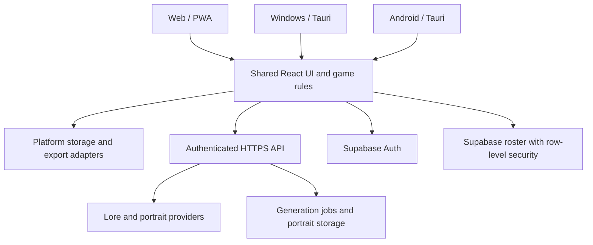

# Web, desktop and Android release plan

Planning date: September 25, 2026. Status: proposed implementation plan; no deployment or native packaging has been performed by this planning task.

## 1. Intended result and scope

Deliver the existing character builder through a public HTTPS website, an installable Windows application, and an Android application suitable for Google Play submission. Preserve the React interface, wheel logic, progression rules, Monkey King Enma mechanics, character identity rules, lore, synergies and abilities across platforms.

Windows is the first desktop target. macOS and Linux are a subsequent desktop expansion with their own build, signing and testing work. iOS, journeys, training, hunting, social challenges, multiplayer, advertisements and payments are outside this release. Flutter is unnecessary for the proposed approach.

Keep one repository. Share game rules and UI; isolate storage, exports, authentication persistence and operating-system integration behind small adapters. Do not turn this into a monorepo migration unless later complexity warrants it.

## 2. Architecture decisions

| Layer | Proposed choice | Reason |
|---|---|---|
| Shared UI | Existing React + Vite | Preserve the functioning game and visual design |
| Shared game logic | Pure JavaScript modules, with schemas at data boundaries | Run the same rules in browsers, installed apps and server validation |
| Website | Vercel frontend and short-lived API functions initially | Existing `vercel.json` and `api/` handlers provide a starting point |
| Web installation | PWA manifest and service worker | Installable web experience and cached offline play |
| Windows and Android | Tauri 2, bundling the frontend assets | One native shell framework; validate integrations in an early prototype |
| Accounts and cloud data | Existing Supabase Auth and Postgres; add managed portrait storage | Preserve account investment and share characters across devices |
| Local roster | IndexedDB on web; SQLite on native through a common repository | Durable, versioned records and explicit synchronization |
| AI | Hosted, authenticated API with server-owned rules and prompts | Keep provider credentials and generation policy off devices |

The logical flow is:

Installed apps bundle the frontend, not Express or provider secrets. Express remains the local development host and optional portable server deployment path. Native clients use an explicit HTTPS API base URL; the website can use same-origin requests. PWA service workers register only in web builds.

Tauri has official [Vite integration](https://tauri.app/start/frontend/vite/), [Windows distribution](https://tauri.app/distribute/windows-installer/) and [Google Play distribution](https://tauri.app/distribute/google-play/) guides. This establishes a viable packaging route, not automatic compatibility for every browser API or plugin. If Android sharing or authentication fails the prototype acceptance tests, evaluate Capacitor for Android while retaining the same shared UI and service interfaces.

## 3. Findings in the current repository

| Finding | Planned action |
|---|---|
| `App.jsx` calls `/api/generate-portrait`; `OllamaService.js` calls `/api/generate-lore` | Introduce one API client with environment-specific base URL, auth, timeouts and typed errors |
| Lore handler accepts `prompt` and `systemInstruction` directly from the client | Accept a validated build and rules version; resolve stats, identity, unlocks and prompts on the server |
| AI handlers do not currently establish caller identity or quotas | Verify tokens, apply shared quotas, validate input and redact provider errors |
| Portrait handler polls the provider up to 25 times within one request | Persist a provider job and return a job ID; check status through bounded requests |
| Frontend and Express artifacts currently share `dist` | Split frontend and server output so native bundles contain only frontend assets |
| Supabase is created directly from environment values | Add configuration checks and an explicit local-only mode without cloud initialization |
| Guest saves use `localStorage`; cloud roster loads raw database rows | Introduce a normalized, versioned save model and migrations |
| Roster mapping does not preserve every presentation field, including portrait and full tier metadata | Normalize round trips and test portrait, tier and identity preservation |
| Exports use browser clipboard and `jsPDF.save()` | Separate document rendering from platform save/share behavior |
| Existing progression and identity tests cover useful domain rules | Extend these as the shared behavior contract across platforms |

Supabase production policies, deployed environment, provider quotas, signing credentials and native SDK installations have not been audited. Do not assume that missing policies in this repository mean the deployed database has no policies; inspect it during implementation.

## 4. Phase 0 — Baseline and native feasibility

Estimated effort: 2–4 developer days.

- Preserve current uncommitted work and record the functioning baseline before restructuring.
- Inventory Node/package-manager versions, lockfiles and existing deployment settings; choose one package manager and an LTS Node version supported by the chosen tooling.
- Run existing tests and production build; distinguish current lint warnings from new regressions.
- Add a minimal Tauri shell without relocating the existing game.
- Set up Rust, Windows C++ build tooling/WebView2, and Android Studio, SDK, NDK and JDK as required by the selected Tauri version. Pin reproducible versions in build documentation. See [Tauri prerequisites](https://tauri.app/start/prerequisites/).
- Run the actual wheel, audio, representative long card, PDF/image export, HTTPS request and authentication callback on Windows and a physical Android phone.
- Verify storage and share/save plugin support on both targets, including native-code work needed for Android content URIs and share intents.
- Choose a permanent application ID, public name and minimum supported OS versions before public native distribution. Start testing with Windows 11 x64 and Android 10+ as product targets; confirm the supported floor against toolchain and device results.

Exit gate: the core game runs in both native shells and the risky integrations have demonstrated paths. Record any required Android adapter or framework adjustment before expanding implementation.

## 5. Phase 1 — Shared application foundation

Estimated effort: 3–5 developer days. Depends on Phase 0.

- Extract platform concerns from `App.jsx` and `CharacterCard.jsx`; retain existing mechanics modules rather than rewriting them.
- Define `CharacterRepository`, `AuthSessionStore`, `ExportService`, `ShareService`, `ExternalLinkService` and `GenerationClient` interfaces.
- Centralize configuration: environment name, public API URL, Supabase public URL/key, application version and rules version. Provider secrets and Supabase service-role keys remain server-only.
- Separate scripts such as `build:web`, `build:server`, `dev:web`, `dev:server`, `desktop:dev`, `desktop:build`, `android:dev` and `android:build` when their implementations exist.
- Make missing cloud configuration produce a clear local-only state rather than prevent startup.
- Keep the currently generated character usable when either lore or portrait generation fails. Treat each generation task as independently retryable.
- Replace blocking browser alerts with app notifications/dialogs that work with touch, keyboard and native shells.
- Maintain stable category/option IDs; resolve rules from IDs rather than trusting client-provided descriptions, rarity values or scores.

Exit gate: web behavior remains intact, every platform uses the same character rules, and the core builder starts without internet access or cloud credentials.

## 6. Phase 2 — Accounts, saves and offline behavior

Estimated effort: 4–7 developer days. Can overlap backend work after interfaces are agreed.

Use a versioned character record containing `id`, `schemaVersion`, `rulesVersion`, `revision`, timestamps, build selections, stats snapshot, tier, identity, lore, synergies and portrait asset metadata. Preserve existing snapshots; do not silently rebalance older characters when rules change.

- Write an idempotent migration from `spinYourDestiny_saves` into local storage. Keep the original until migration and record-count verification succeed. Provide recovery for malformed JSON.
- Persist saves locally first, including for signed-in players; queue cloud operations and expose pending/synced/error states.
- Use stable UUIDs and idempotent upserts to avoid duplicates after retries.
- Use server revision checks for conflicts. Keep both conflicting edits as named copies rather than silently overwrite user work.
- Represent deletion with a synchronization tombstone so another offline device does not restore a deleted record.
- Keep accounts isolated locally. Signing into another account must not upload the previous user's roster. Offer explicit import of guest characters.
- Verify row-level security on cloud characters, jobs and assets: users can read/write only their own records. Test with two real test accounts.
- Add password reset, email confirmation return paths, sign-out and expired-session recovery. Configure native deep links and web redirect allowlists. See [Supabase native auth links](https://supabase.com/docs/guides/auth/native-mobile-deep-linking).
- Keep native refresh tokens in an OS-backed secure store through an audited adapter; do not treat plain SQLite or a preferences file as credential protection.
- Add JSON roster backup/import with schema validation. This also provides a recovery path for browser storage eviction or app uninstall.

| Capability | Offline behavior |
|---|---|
| Spin, resolve stats, unlock abilities and deterministic synergies | Fully available |
| Save, reopen, delete and export a local character | Available; portrait export requires cached artwork |
| New AI lore or portrait | Explicitly unavailable; optional retry when connected, without automatic paid requests |
| Previously saved lore/portrait | Available if cached locally |
| Account creation and cloud synchronization | Requires connection |

Exit gate: an offline character survives restart, syncs once after reconnection, and can move between web and Android without losing fields. Legacy saves and account-switch isolation tests pass.

## 7. Phase 3 — Public backend and AI generation

Estimated effort: 4–7 developer days.

- Version the API, for example `/api/v1/lore`, `/api/v1/portraits`, and `/api/v1/jobs/:id`.
- Require a verified account for cloud AI generation initially; guest wheel creation remains unlimited locally. A limited guest AI trial is a later product decision.
- Receive validated build IDs and rules version. Recompute rules and compose identity/lore instructions on the server. Keep old rules versions available for supported installed clients.
- Validate AI response shape, length and expected fields. Check obvious locked-power and identity violations; bound repair attempts and return a recoverable error rather than accept malformed output. Schema checks cannot prove all prose is mechanically correct, so retain sampled quality review.
- Apply per-account quotas, concurrent-job limits, payload limits and durable rate limits. Use idempotency keys for generation requests and record usage so retries do not deliberately submit duplicate jobs. Reconcile uncertain provider submissions rather than blindly retrying them.
- Return sanitized errors and request IDs. Log provider latency and failures without logging tokens or unnecessary personal content.
- For portraits, persist provider job ID/status and return immediately. Authenticated status requests or a verified provider webhook update the record; no in-process timer should be required after the function response.
- Validate provider status/asset hosts before server fetching. Never accept arbitrary credential-bearing fetch URLs from clients.
- Copy completed portraits to app-controlled storage where provider terms allow; track ownership and retention. Cache local copies for offline cards. Recover expired provider URLs gracefully.
- Allow only required web/native origins and headers, but use verified tokens as authorization; CORS is not a substitute for it.
- Add generation status recovery after app backgrounding, network interruption or process death. Use timeouts and backoff; do not poll indefinitely.

The existing Vercel layout is the default deployment path, subject to measured execution time and cost. Compare requests against [Vercel function limits](https://vercel.com/docs/functions/limitations). If lore routinely exceeds the chosen limits, add a durable worker before launch; do not rely on unawaited work in a serverless function.

Exit gate: unauthenticated and cross-account requests fail safely, quotas work across server instances, a portrait resumes after closing the app, and provider failure cannot destroy the local character.

## 8. Phase 4 — Web and PWA release

Estimated effort: 2–4 developer days.

- Configure separate development, staging and production environments; deploy the Vercel website/API and verify routes, secrets and HTTPS.
- Add original app icons, manifest, standalone display mode and installation guidance appropriate to each browser.
- Cache hashed frontend assets and required fonts for offline use; do not cache authenticated API responses indiscriminately.
- Offer an update prompt when a new web version is available. Avoid replacing the running app halfway through a spin or save.
- Add a reconnect state and local-only start flow; test airplane-mode reload after first successful load. A PWA cannot perform its first-ever load offline.
- Test mobile layout, safe areas, landscape mode, touch targets, keyboard navigation, text contrast and reduced-motion settings.
- Lazy-load export libraries and measure wheel responsiveness on a representative low-end phone; load portraits without layout jumps.
- Add public support, privacy and account-deletion pages plus a download page for native releases.

Exit gate: a new user can build and save a character from the public link; after caching, the PWA reopens offline without losing progress. PWA behavior follows [web.dev guidance](https://web.dev/learn/pwa/welcome).

## 9. Phase 5 — Windows release

Estimated effort: 2–4 developer days after the prototype and shared foundation.

- Bundle local frontend assets and restrict Tauri capabilities to necessary operations. Open external websites in the system browser; never grant remote pages native privileges.
- Implement native file dialogs, clipboard and a consistent export path for PNG/PDF/JSON. Separate card rendering from saving generated bytes.
- Ensure portrait images and fonts are exportable without cross-origin canvas failures. Limit raster size for very long cards and provide readable multi-page PDFs.
- Test resizing, high-DPI scaling, keyboard focus, audio after resume, and persistence across install upgrades.
- Produce a versioned Windows installer and checksums. Configure Windows signing for the public release and keep signing material outside the repository.
- Add signed desktop updates with a stable and preview channel, release notes and a user-visible install action. OS signing and updater signatures are separate concerns. See [Tauri updater](https://tauri.app/plugin/updater/).
- Test update failure and recovery. Retain a previous installer and database backups; do not downgrade a migrated database blindly.

Exit gate: a clean Windows machine installs, creates, exports, signs in, reopens saves and upgrades successfully without Node.js or development tooling.

## 10. Phase 6 — Android release candidate

Estimated effort: 4–7 developer days.

- Set package ID, app label, adaptive icon, splash screen and monotonically increasing version code.
- Target the Google Play API requirement effective at submission and validate native-library/16 KB page-size compatibility against current Play tooling. Recheck requirements before every release rather than freeze this plan to an old SDK number. See [target API policy](https://support.google.com/googleplay/android-developer/answer/11926878?hl=en).
- Implement Android Back handling: close overlays first, then navigate, without silently discarding a build.
- Preserve an in-progress build on pause/process death. Resume jobs and refresh expired sessions after foregrounding.
- Implement Android share/save using supported platform adapters and content URIs. Request only permissions actually needed; avoid broad storage permissions for document export.
- Test safe areas/edge-to-edge display, keyboard overlap, rotation, long cards, audio focus and slower devices.
- Test on an emulator and at least one physical phone, covering the selected minimum OS and a current OS where available.
- Produce an APK for direct testing and a signed AAB for Play. Back up upload-key material securely and document recovery. Follow [Android signing](https://tauri.app/distribute/sign/android/) and [Play packaging](https://tauri.app/distribute/google-play/).
- Use Google Play for Play-distributed app updates; do not reuse the desktop updater to replace Android executable content.

Exit gate: the release build passes install/upgrade, offline restart, sign-in return, cloud sync, export/share and background-resume tests on real hardware.

## 11. Phase 7 — Google Play submission

Engineering preparation: 2–4 developer days. Testing and review add calendar time.

- Confirm the developer account type, identity/device verification, supported registration/payment availability and ownership of the final package ID. Google lists a [US$25 one-time registration fee](https://support.google.com/googleplay/android-developer/answer/6112435?hl=en).
- Prepare listing text, icon, screenshots, feature graphic, support contact, target audience, content rating, app-access instructions and accurate Data safety disclosures.
- Implement account/data deletion in-app and through a public web route, including saved records and owned portraits; document legitimate retention exceptions. See [account deletion requirements](https://support.google.com/googleplay/android-developer/answer/13327111?hl=en).
- Because the app generates lore and images, implement content safeguards and in-app reporting tied to a generation ID, plus a process for reviewing reports. See [AI-generated content policy](https://support.google.com/googleplay/android-developer/answer/14094294?hl=en).
- Review One Piece/Naruto names, branding, artwork, sound and generated imagery before public distribution. Do not assume that a fan disclaimer grants rights. Establish permissions where necessary or choose an original/licensed content edition; renaming the store listing alone does not resolve the underlying content question. See [intellectual property policy](https://support.google.com/googleplay/android-developer/answer/9888072?hl=en).
- Start with internal testing, then the applicable closed-test track. For personal accounts created after November 13, 2023, Google currently requires at least 12 testers opted in continuously for 14 days before applying for production access. Passing that duration does not guarantee approval. See [testing requirements](https://support.google.com/googleplay/android-developer/answer/14151465?hl=en).
- Address pre-launch report findings and reviewer feedback, then use a staged production rollout with error monitoring and a halt procedure.

Exit gate: approved production access and app review, completed release checklist, and successful staged rollout. Approval timing remains external to the engineering estimate.

## 12. Testing and release operations

| Area | Required checks |
|---|---|
| Game rules | Same fixture produces the same stats/unlocks on all platforms; Enma stages, legacy identity and category skips remain correct |
| Save migration | Legacy fixtures, malformed records, repeat migration, schema upgrades, portraits and full tier round trips |
| Synchronization | Offline create/update/delete, duplicates, concurrent revisions, expired tokens, account switching and tombstones |
| Backend | Invalid builds, token verification, ownership, rate limits, idempotency, provider timeouts and malformed AI output |
| UI | Manual and automatic spins, conditional wheels, cancellation/navigation, roster, card, accessibility and reduced motion |
| Native | Installation, upgrade, clean uninstall behavior, auth links, back navigation, export/share and process death |
| Offline | Cached startup, missing artwork, recovery after reconnect and no surprise generation charges |

Set up CI to run lint with no new warnings, unit/integration tests and frontend build on each change. Build Windows artifacts on Windows and Android artifacts with a pinned SDK/NDK/JDK toolchain. Keep signing credentials in the CI secret store, with production release access limited to trusted jobs. macOS would require its own build/signing pipeline when added.

Publish matching app, schema and rules versions. Keep the backend compatible with at least the current and previous supported native release during rollout. Prefer additive database migrations and maintain backups with a tested restore procedure. Web rollback must not invalidate records written by a newer client.

Monitor crash/error rate, failed saves, sync backlog, generation latency, provider failures and AI spend. Establish alert thresholds from staging measurements and set a hard spending budget before public AI access. Keep personal data and access tokens out of telemetry. Record a release checklist and support/runbook instructions in the repository.

## 13. Sequence, effort and launch dependencies

Recommended dependency order: baseline/native prototype → shared foundation → storage and backend → web beta → Windows/Android candidates → Play testing and production review. Signing/account setup and content-rights review can start early because they may take calendar time independent of coding.

The phase estimates total approximately 23–42 focused developer days, about 5–9 working weeks for one experienced developer. This is a planning range, not a delivery promise; native adapter issues, existing bugs, content changes and account/provider setup can extend it. The eligible-account closed test takes at least 14 consecutive days, and store review/production-access timing is additional, with some preparation overlapping development.

Budget categories: domain, hosting/functions, Supabase storage/database, AI text and portrait usage, CI artifacts, Windows signing, Play registration and test devices. Avoid committing to a monthly total before measuring generation cost. Estimate AI spend as successful generations plus retries multiplied by measured provider unit costs; set account quotas and an overall budget accordingly.

Decisions needed before the relevant release step, without blocking shared foundation work:

- Final app name and owned package/domain identifier.
- Windows-only initial desktop release or funded macOS/Linux expansion.
- Launch audience/regions and their hosting/account availability requirements.
- Developer account owner/type and initial tester group.
- Approved monthly hosting/AI budget and per-account generation quota.
- Content rights/original-content strategy for public publication.

## 14. First implementation milestone

Deliver the baseline tests, split frontend/server builds, common API/config layer, local-only startup and a Windows/Android feasibility shell. Demonstrate one complete character build and one native export on each target. Then commit to the remaining rollout against measured results.

This milestone should leave the current character-building experience intact and produces a concrete foundation for all three platforms before any public deployment or store submission.
